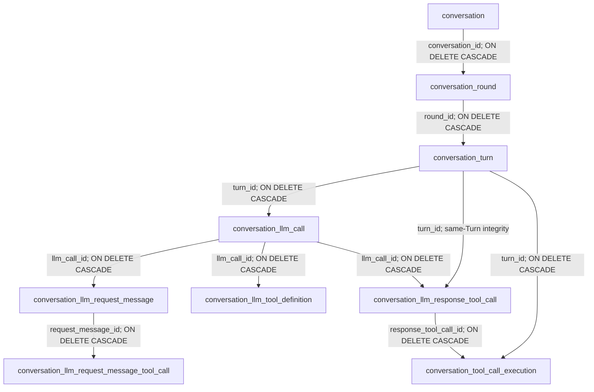
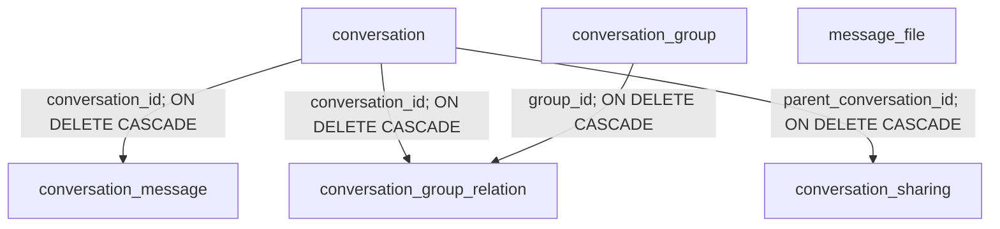

# Conversation Execution Persistence Relationships

Status: implemented schema model for AgentBreaker `0.0.1`

This document describes the ownership hierarchy, foreign keys, and physical-delete cascade behavior
of conversation-manager. It complements the detailed transaction and validation design in
`conversation-manager-core/docs/round-turn-persistence-design.md`.

## Execution Aggregate

One Conversation contains ordered Rounds. One Round contains ordered Turns, and one Turn represents
one LLM call plus all Tool executions triggered by that call.

### Logical Ownership Overview

```text
conversation
└─ round
   └─ turn
      ├─ llm_call
      │  ├─ request_messages
      │  │  └─ request_message_tool_calls
      │  ├─ tool_definitions
      │  └─ response_tool_calls
      └─ tool_call_executions
         └─ references response_tool_call
```

This tree is the quickest view of the execution aggregate:

- a Conversation owns ordered Rounds, and each Round owns ordered Turns;
- a Turn owns exactly one LLM call and zero or more Tool execution outcomes;
- the LLM call owns the exact request messages, frozen Tool definitions, and response Tool calls
  needed for audit and logical replay;
- request-message Tool calls belong to historical assistant messages already present in model
  context, while response Tool calls are emitted by the current LLM call;
- Tool executions are direct children of the Turn because they are runtime work performed after
  the LLM response, but each execution still references exactly one response Tool call;
- parallel response Tool calls remain separate execution records inside the same Turn.

The plural labels in this overview describe logical collections. The Mermaid diagram below uses the
actual singular PostgreSQL table names and shows the concrete foreign-key paths.

### Physical Foreign Keys



The structure has branches below an LLM call rather than one linear chain:

- request messages are the normalized context sent to the model;
- request-message Tool calls preserve Tool calls already present in historical assistant messages;
- Tool definitions are frozen snapshots of the Tools actually offered in that request;
- response Tool calls are newly emitted by the current model response;
- Tool executions belong to the Turn and reference exactly one current response Tool call.

## Cardinality And Ownership

| Parent | Child | Cardinality | Important rule |
| --- | --- | --- | --- |
| Conversation | Round | one-to-many | `round_number` is unique inside a Conversation |
| Round | Turn | one-to-many | `turn_number` is unique and continuous inside a Round |
| Turn | LLM call | one-to-one | A persisted Turn contains exactly one LLM call |
| LLM call | Request message | one-to-many | `message_order` preserves provider request order |
| Request message | Historical Tool call | one-to-many | Only assistant request messages contain these calls |
| LLM call | Tool definition | one-to-many | `tool_order` preserves the offered Tool order |
| LLM call | Response Tool call | one-to-many | Multiple Tool calls may be emitted in parallel |
| Response Tool call | Tool execution | one-to-one | Every emitted call has exactly one outcome |

Tool definitions and Tool executions use the globally unique and permanently stable `tool_key`.
The database `id` inherited from `EntityBase` identifies only a local snapshot or execution row.

## Logical Delete Versus Physical Cascade

Normal `DeleteRounds` behavior is logical:

- it marks a tail suffix of Round rows as deleted;
- it retains Turns, LLM calls, Tool snapshots, and Tool execution data;
- normal history and replay queries exclude tombstoned Rounds;
- it never decreases `conversation.latest_round_number`.

The `ON DELETE CASCADE` relationships in the diagram apply only to physical deletion. They support
a later authorized retention or purge job. A physical Conversation purge removes its Rounds and all
execution descendants. A physical Round purge removes only that Round subtree.

Soft deletion does not activate PostgreSQL foreign-key cascades.

## Same-Turn Tool Integrity

`conversation_llm_response_tool_call` stores both `llm_call_id` and `turn_id`.
`conversation_tool_call_execution` stores both `response_tool_call_id` and `turn_id`.
Composite foreign keys ensure that a Tool execution cannot point to a response Tool call from a
different Turn.

The database enforces at most one execution row for each response Tool call. The save service must
also validate the inverse requirement before commit: every emitted response Tool call has one
execution record, including failed and cancelled calls.

## Existing Conversation-Owned Tables

The legacy HTTP model remains beside the Round/Turn execution aggregate:



`conversation_message` is preserved for existing HTTP behavior and is not dual-written by the new
Round/Turn RPC. `message_file` is deliberately shown without an edge because it currently has no
database foreign key to a Conversation or message and therefore has no cascade behavior.
