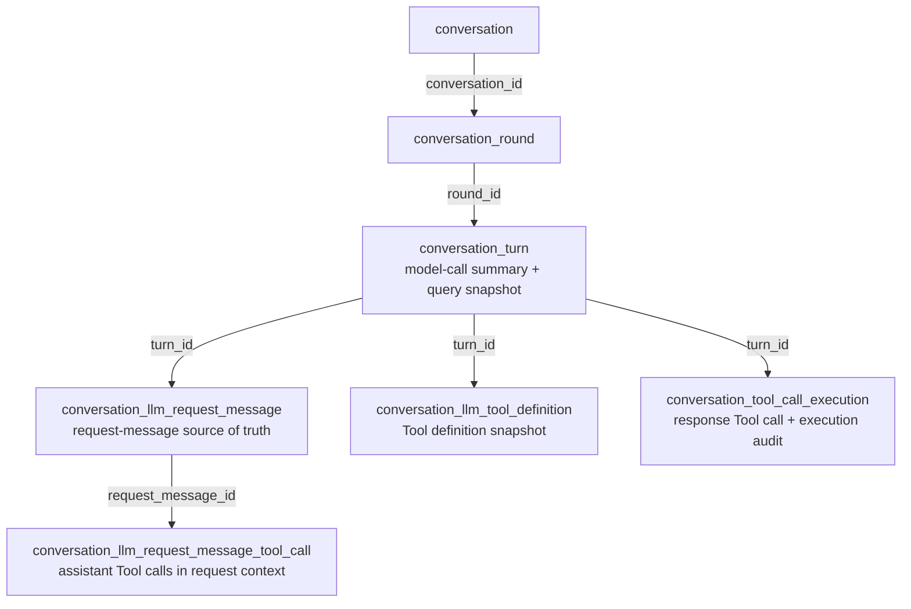

# Conversation Execution Persistence Relationships

Status: implemented target design; schema cutover and runtime cleanup verified on 2026-08-25.

This document defines the active logical ownership hierarchy for the Round/Turn execution
aggregate. The 2026-08-25 consolidation migration backfilled the target columns, compared the
normalized records, removed the transitional LLM-call tables, and removed the empty legacy message
table. New implementation work must follow this model and must not silently create a second
ownership model.

## Execution Aggregate

One Conversation contains ordered Rounds. One Round contains ordered Turns. One Turn represents one
model invocation and all Tool executions triggered by that invocation.


```mermaid
flowchart TD
    CONVERSATION["conversation"]
    ROUND["conversation_round"]
    TURN["conversation_turn<br/>model-call summary + query snapshot"]
    REQUEST_MESSAGE["conversation_llm_request_message<br/>request-message source of truth"]
    REQUEST_TOOL_CALL["conversation_llm_request_message_tool_call<br/>assistant Tool calls in request context"]
    TOOL_DEFINITION["conversation_llm_tool_definition<br/>Tool definition snapshot"]
    TOOL_EXECUTION["conversation_tool_call_execution<br/>response Tool call + execution audit"]

    CONVERSATION -->|"conversation_id"| ROUND
    ROUND -->|"round_id"| TURN
    TURN -->|"turn_id"| REQUEST_MESSAGE
    REQUEST_MESSAGE -->|"request_message_id"| REQUEST_TOOL_CALL
    TURN -->|"turn_id"| TOOL_DEFINITION
    TURN -->|"turn_id"| TOOL_EXECUTION
```

The target model removed two transitional tables during the contract migration:

- `conversation_llm_call` is merged into `conversation_turn`.
- `conversation_llm_response_tool_call` is merged into `conversation_tool_call_execution`.

`conversation_llm_request_message` remains the normalized source of truth for model request
messages. `conversation_turn.request_messages_snapshot` is a denormalized, read-optimized copy;
it is written in the same transaction and is never an independent edit target.

## Table Responsibilities

### `conversation`

```text
conversation
- id
- conversation_id
- title
- pinned
- latest_round_number
- deleted
```

`latest_round_number` is a monotonically increasing high-water mark. Logical deletion never lowers
it, and a retired number cannot be reused.

### `conversation_round`

```text
conversation_round
- id
- conversation_id
- round_number
- user_request_content
- user_request_content_parts
- final_answer_content
- final_answer_content_parts
- final_source_turn_number
- status
- error_message
- start_time
- end_time
- trace_id
- payload_hash_version
- payload_hash
- deleted
- deletion_time
- deleted_by
```

One row represents one user request through a final answer, failure, or cancellation. Scalar text
and structured content parts are mutually exclusive. `payload_hash` is the idempotency identity for
an exact retry of an active Round.

### `conversation_turn`

```text
conversation_turn
- id
- round_id
- turn_number
- agent_id
- agent_name
- agent_version
- status
- error_message
- start_time
- end_time
- llm_start_time
- llm_end_time
- message_storage_mode
- request_messages_snapshot
- request_messages_snapshot_hash
- request_id
- trace_id
- response_message_present
- response_content
- response_content_parts
- finish_reason
- usage_present
- prompt_tokens
- completion_tokens
- total_tokens
- cached_prompt_tokens
- reasoning_tokens
- raw_request
- raw_response
- response_error_message
- reasoning_content
```

One row represents one model invocation and the Tool work triggered by that invocation.

Time semantics are intentionally separate:

- `start_time` and `end_time` are the orchestration boundary of the Turn.
- `llm_start_time` and `llm_end_time` are the model-provider call boundary.
- The Turn timestamps do not contain a Tool-duration aggregate. A Turn may end slightly after the
  model call because the runtime is finishing the Turn, but each Tool's exact timing is stored only
  in `conversation_tool_call_execution`.

The model request/response audit fields formerly owned by `conversation_llm_call` are now stored on
the Turn. Provider, model, temperature, output-token limits, and other fixed Agent settings are not
duplicated here: formal executions prohibit runtime model-parameter overrides and recover those
settings from the immutable `agent_id + agent_version` definition. The actual response, usage,
request ID, trace ID, timing, errors, and retained raw payloads remain on the Turn because they are
facts about this invocation, not Agent configuration.

`message_storage_mode` is `FULL_SNAPSHOT` for the first Turn in a Round and `APPEND_DELTA` for later
Turns. `request_messages_snapshot` is only a fast lookup projection. Full replay, context
reconstruction, and consistency checks use `conversation_llm_request_message`.

### `conversation_llm_request_message`

```text
conversation_llm_request_message
- id
- round_id
- turn_id
- message_order
- role
- content
- content_parts
- tool_call_id
```

One row is one normalized message sent in one model request. `message_order` preserves provider
request order. `content` and `content_parts` are mutually exclusive. `tool_call_id` is populated
only for a `TOOL` role message and identifies the assistant Tool call whose result it supplies.

This table is the source of truth for request messages. It is not reconstructed from Tool execution
rows and is not replaced by the JSON snapshot on `conversation_turn`.

### `conversation_llm_request_message_tool_call`

```text
conversation_llm_request_message_tool_call
- id
- round_id
- turn_id
- request_message_id
- call_order
- tool_call_id
- type
- function_name
- arguments
```

One row is one Tool call embedded in an assistant request message already present in model context.
An assistant message may contain multiple Tool calls, so `conversation_llm_request_message.tool_call_id`
cannot represent this collection. This table remains normalized and strongly typed rather than
putting the collection into a JSONB message column.

### `conversation_llm_tool_definition`

```text
conversation_llm_tool_definition
- id
- round_id
- turn_id
- tool_order
- tool_key
- tool_name
- source_type
- description
- parameters_json
- strict
- definition_hash
```

One row is one Tool definition actually offered to the model for this invocation. The snapshot is
required even when the Agent definition is immutable because runtime availability, MCP credential
resolution, optional-server filtering, and Tool registration state can change the set visible to a
particular call.

### `conversation_tool_call_execution`

```text
conversation_tool_call_execution
- id
- round_id
- turn_id
- call_order
- tool_call_id
- type
- tool_name
- arguments
- tool_key
- status
- result_content
- result_content_parts
- raw_result
- error_message
- start_time
- end_time
```

One row represents both the current model response's Tool call and the complete execution outcome.
It is the authoritative Tool execution and audit record. `call_order` is the order in the model
response; it is not completion order. Parallel calls retain their model order while recording
independent execution timestamps.

Every emitted model Tool call has exactly one row, including failed, cancelled, rejected, and
unknown outcomes. `(turn_id, tool_call_id)` identifies the response Tool call after
`conversation_llm_response_tool_call` is removed. `tool_key` is the stable business identity;
`tool_name` is the provider-visible name used in that request.

## Cardinality And Ordering

| Parent | Child | Cardinality | Ordering or integrity rule |
| --- | --- | --- | --- |
| Conversation | Round | one-to-many | `round_number` is unique inside a Conversation |
| Round | Turn | one-to-many | `turn_number` is continuous and unique inside a Round |
| Turn | Request message | one-to-many | `message_order` preserves model request order |
| Request message | Request-message Tool call | one-to-many | `call_order` preserves assistant Tool-call order |
| Turn | Tool definition | one-to-many | `tool_order` preserves offered Tool order |
| Turn | Tool execution | one-to-many | `call_order` preserves response Tool-call order |
| Emitted response Tool call | Tool execution row | one-to-one | One terminal row per emitted Tool call |

All child tables that participate in Round execution carry `round_id` for direct diagnostics. They
also carry their more precise parent key (`turn_id` or `request_message_id`) where applicable.

## Auxiliary Runtime Evidence

The in-progress Streamable HTTP path has two separate evidence tables:

```text
conversation_round_mutation
- round_id
- mutation_id
- payload_hash
- committed_revision

conversation_tool_dispatch
- round_id
- turn_number
- attempt_id
- tool_call_id
- tool_name
- tool_key
- server_id
- arguments_json
- state
- dispatch_time
- result_time
- trace_id
- span_id
- transport_evidence
- recovery_reason
```

`conversation_round_mutation` is an idempotent command ledger. `conversation_tool_dispatch` records
network delivery attempts and recovery state. Neither table replaces the normalized Turn request or
Tool execution records. A dispatch may have multiple attempts; the final normalized Tool result is
stored in `conversation_tool_call_execution`.

## Relationships And Database Constraints

The core Round/Turn links are application-managed logical relationships. Conversation Manager
validates ownership, ordering, same-Turn Tool linkage, and one-execution-per-response-call before
committing the aggregate. Existing dispatch/progress migrations may use PostgreSQL foreign keys for
their own lifecycle tables; that does not make the entire execution aggregate foreign-key managed.

Normal `DeleteRounds` is logical: it tombstones a tail suffix and retains child evidence. A separate
retention operation may physically purge the aggregate in reverse ownership order after policy and
authorization checks.

The transitional schema and the target schema coexist only during migration. The migration must
verify row counts, logical keys, message order, Tool-call linkage, timestamps, and replay output
before the old tables are dropped.

## HTTP And Resource Tables

Grouping, sharing, and file tables remain for their existing HTTP and resource responsibilities.
`conversation_message` was verified to contain zero rows, included in the pre-cutover backup, and
removed by the contract migration. The normalized Round/Turn execution path is now the source for
history, replay, and export. The old message-history endpoint, Mapper, entity, DTO, and service
methods were removed in the same coordinated release, so no runtime code depends on the deleted
table.

## Migration Verification Record

The development database was backed up before the cutover and the backup was independently
restored into a temporary database for migration verification:

- Backup directory: `C:\Users\admin\AppData\Local\Temp\agentbreaker-conversation-manager-backup-20260825`
- Dump: `conversation_manager_pre_consolidation_20260825.dump`
- SHA-256: `82EB2C01E075C1FBD76266D73EBE54BF5EF126F55360337D84530975A7D79EE0`
- Pre-cutover counts: 881 Conversations, 623 Rounds, 696 Turns, 1,835 request messages, and 227 Tool executions
- Pre-cutover `conversation_message` count: 0
- Post-cutover transitional tables: absent
- Restored-copy verification: 881 Conversations, 623 Rounds, 696 Turns, 1,835 request messages, and 227 Tool executions
